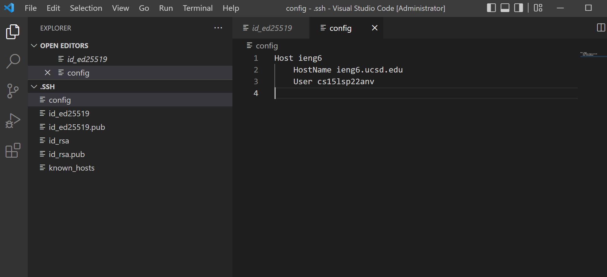
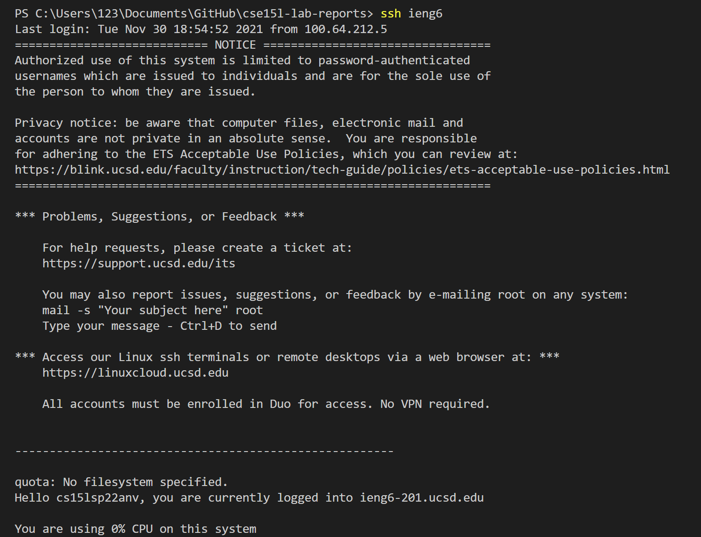
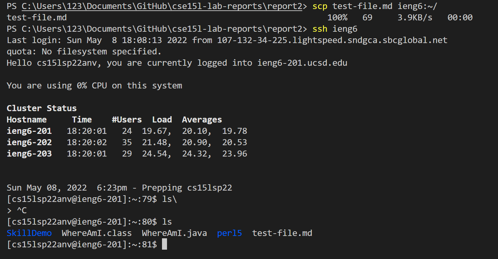

# Yucheng's Week 6 Lab Report 3
In this week's report, I will write about some implementation of all Group Choice Options in lab 5. I will show how I did them in this report. Let's start with the first one.
</img>
## The first one: Streamlining ssh Configuration
First I will show how I edit my `.ssh/config` file. Here is the screenshot of my code:
I create a new file like this and put these codes into this file, this directly tells `ssh` to log into my account.
Then the ssh command logging into my account using just the alias I chose:

Then we can also directly using scp with the alias I chose:

This case we copy test-file.md from my computer to the account.
## The second one: Setup Github Access from ieng6
11213123