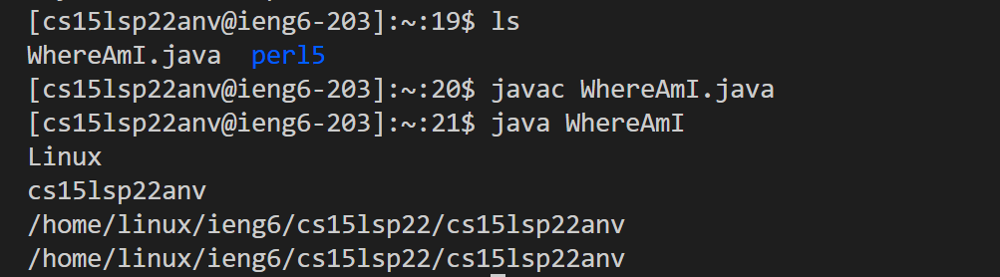

# Yucheng's Week 2 Lab Report
Hi, my name is Yucheng and this is my first lab report for CSE 15L. I'm going to give you and myself a tutorial about how to log into a course-specific account on `ieng6`.

</img>This is my little dog.
## Step 1: Intalling VS Code
First of all, you need to have VScode on your computer. Here's the link for VScode intalling: [vscode](https://code.visualstudio.com/). Select your system and download it, and then open, you will find this:

All right, now you have a good beginning!
## Step 2: Connecting remotely
In this step, we’ll see how to connect to a remote computer for doing work there. If your system is Windows, you should first check if you have OpenSSH (if not, download it). Here is a clear instruction: [OpenSSH](https://docs.microsoft.com/en-us/windows-server/administration/openssh/openssh_install_firstuse). Then, let's connect.

Do you know your account? Let's find it on [ucsd-website](https://sdacs.ucsd.edu/~icc/index.php). Insert your username and PID here, and then press submit:

You will find your account as cs15lxxxxyyy (y represents your account). 

Then we come to the formal work. Here's a instruction for connecting remotely: [remote-connecting](https://code.visualstudio.com/docs/remote/ssh#_connect-to-a-remote-host). Follow it.

Now, we need to open terminal in VS Code and input your command. Your command will look like this `$ ssh cs15lsp22yyy@ieng6.ucsd.edu`. (Don't forget that yyy is what we find in ucsd website but not "yyy"). If this is your first time connecting remotely, you may get a message that asks you `(yes/no/[fingerprint])?`. Type yes, and then press enter. Input your password and then you will find something like:
```
Last login: Wed Dec  1 15:07:17 2021 from cpe-75-80-50-203.san.res.rr.com
Attempting to create directory /home/linux/ieng6/cs15lsp22/cs15lsp22anv/perl5
============================ NOTICE =================================
Authorized use of this system is limited to password-authenticated
usernames which are issued to individuals and are for the sole use of
the person to whom they are issued.

Privacy notice: be aware that computer files, electronic mail and
accounts are not private in an absolute sense.  You are responsible
for adhering to the ETS Acceptable Use Policies, which you can review at:
https://blink.ucsd.edu/faculty/instruction/tech-guide/policies/ets-acceptable-use-policies.html
=====================================================================

*** Problems, Suggestions, or Feedback ***

    For help requests, please create a ticket at:
    https://support.ucsd.edu/its

    You may also report issues, suggestions, or feedback by e-mailing root on any system:
    mail -s "Your subject here" root
    Type your message - Ctrl+D to send

*** Access our Linux ssh terminals or remote desktops via a web browser at: ***
    https://linuxcloud.ucsd.edu

    All accounts must be enrolled in Duo for access. No VPN required.


-------------------------------------------------------

quota: No filesystem specified.
Hello cs15lsp22anv, you are currently logged into ieng6-203.ucsd.edu

You are using 0% CPU on this system

Cluster Status
Hostname     Time    #Users  Load  Averages
ieng6-201   15:55:01   17  0.08,  0.16,  0.31
ieng6-202   15:55:01   13  1.09,  1.06,  1.08
ieng6-203   15:55:01   5   2.30,  2.27,  2.22


Sun Apr 10, 2022  3:57pm - Prepping cs15lsp22
```
This one is from my account. I use code block here instead of screenshot. They are just the same.
Now, your computer is called the *client* and the computer in the basement the *server* based on how you are connected. Great!

## Step 3: Let's try some command.
Try running the commands `cd`, `ls`, `pwd`, `mkdir`, and `cp`. Both on your computer, and on the remote computer after ssh-ing. Here's my tries:   
Since there's too many things in cs15lsp22, I omit some part of `ls`'s result when screenshoting. So after my attempts, I understand that `ls` shows what files in the directory we now on. `cat` displays the file we appoint to. `cp` copy the file in the server to our computer but we don't have permission now. `mkdir` is making directory. `pwd` shows where we are. `cd` is teleport. For example, `cd ..` brings us back one directory; `cd ~` and `cd` bring us to the homepage... By the way, we may use something like `-a` to show our intention for "all"

## Step 4: Moving file by `scp`
We’ll now see another way to copy a file from your computer to the client. The command is called scp, and we will always run it from the client. Create a file on your computer called **WhereAmI.java** and put the following contents into it:
```
class WhereAmI {
  public static void main(String[] args) {
    System.out.println(System.getProperty("os.name"));
    System.out.println(System.getProperty("user.name"));
    System.out.println(System.getProperty("user.home"));
    System.out.println(System.getProperty("user.dir"));
  }
}
```
Compile and run it on your computer. I get the result like: 
Then, in the terminal from the directory where you made this file, run this command:

`scp WhereAmI.java cs15lsp22yyy@ieng6.ucsd.edu:~/`(again, yyy is from your account)

Log in again to `ieng6`, then you will find "WhereAmI.java"! Here's mine:

 

## Step 5: Setting an SSH Key
In this step, we want to find ways to avoid repetitively inputting our password (a time-consuming work). Here's a good solution: `ssh` keys. Run `ssh-keygen` on your computer. Enter password (mine is empty), and you will see this: 
This one is the private one and we should keep it on our computer. Then the public one. Create the public one and then use scp moving it to the server. Since my computer's system is Windows, so I need to follow these steps: [User-key-generation](https://docs.microsoft.com/en-us/windows-server/administration/openssh/openssh_keymanagement#user-key-generation).
This is my code:

Then, use scp and we will find that we can connect to the server without entering our password! Here's my attempt:

## Step 6: Optimizing Remote Running
Now, we try to optimize our operation. Such as, we can use `""` to indicate a following step. Let's see whether it works:

It does work! We connect to the server and then list files in our homepage directory! Then we try to use `;` to indicate several steps:

We see that we copied **WhereAmI.java** as **OtherMain.java** and run **WhereAmI.java** in a single line! In this case, we can easily edit our local file and then copy it to the server!
# The End
