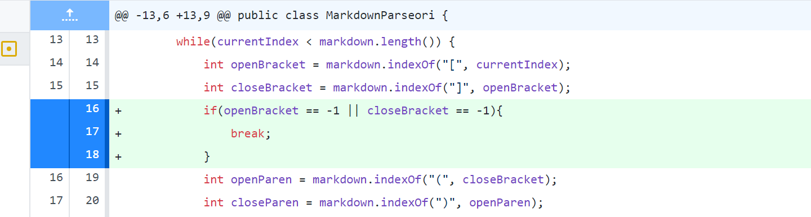
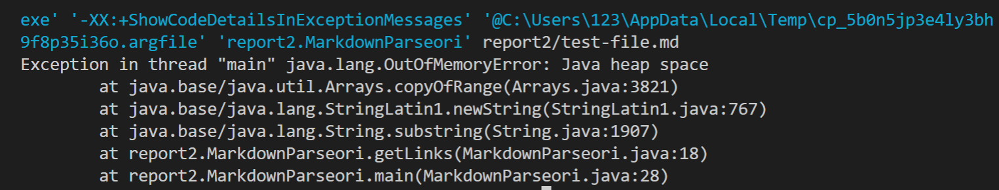
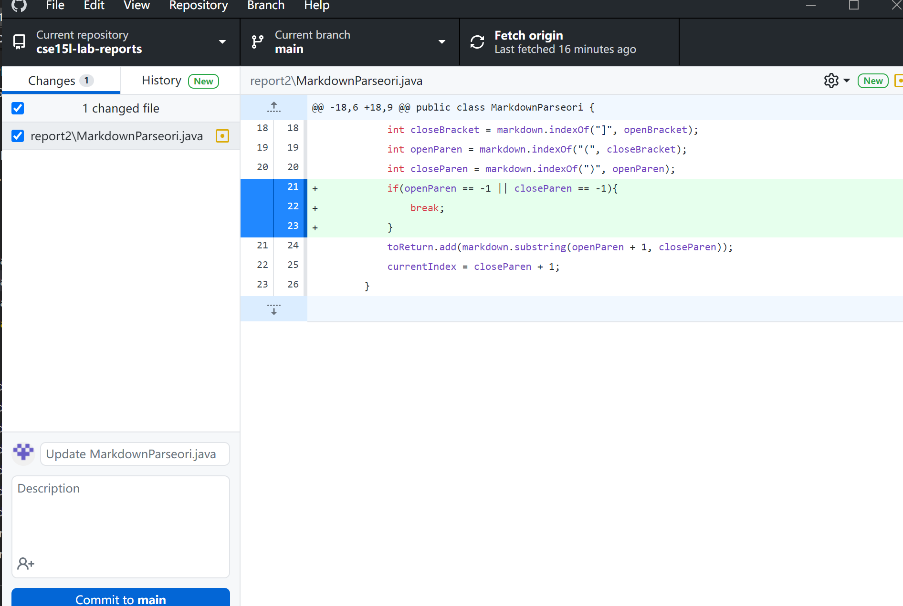
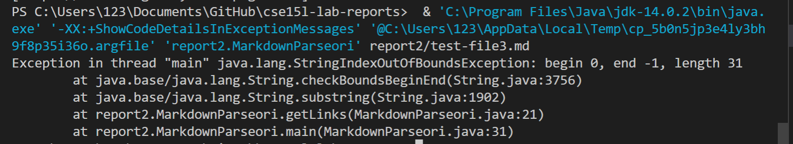
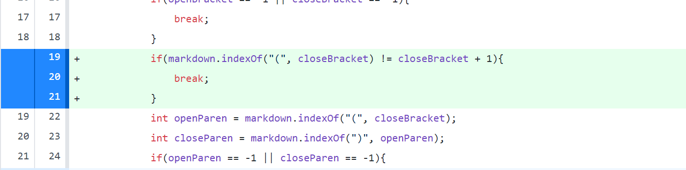
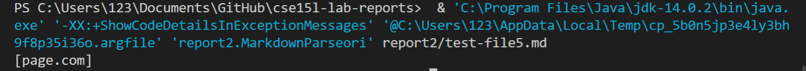

# Yucheng's Week 4 Lab Report 2
In this week's report, I will write about some changes I made to fix a bug. I will list three of them in this report. Let's start with the first one.
</img>
## The first one: Stop infinite loop

I applied this change because I find an error when I run with [test-file](test-file.md). The output of running is 
The first bug is about 
```
int openBracket = markdown.indexOf("[", currentIndex);
```
Since we have a while loop, we will not stop it since if there's no more open bracket or close bracket after the current index, it will let `openBracket = -1` or `closeBracket = -1`. so we will keep looping. By inserting `if` after it, I assure that it will stop loop when there's no more close or open bracket after the currect index.
## The second one: Check the existence of parenthesis

I applied this change because I find an error when I run with [test-file3](test-file3.md). The output of running is 
The second bug is about
```
markdown.indexOf("(", closeBracket)
markdown.indexOf(")", openParen)
```
if there's no "(" or ")" after the close bracket, the `indexOf` command will 
```
toReturn.add(markdown.substring(openParen + 1, closeParen));
```
let the openParen or closeParen eqaul to -1. That's not what we want and will be out of boundary since there's no "-1" index in `.substring` command. Our change will assure that if there's no open or close parentheses after brackets, we will print nothing.
## The third one: Check if adjacent

I applied this change because I find an error when I run with [test-file5](test-file5.md). The output of running is 
The third bug is that we won't print anything from this file. That's because the parenthesis is not adjacent to the close bracket. After inserting this change, we will not read them.
# The End