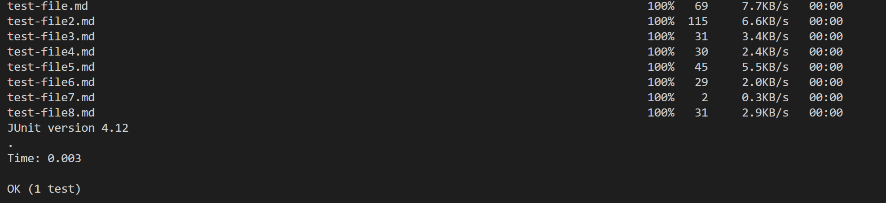

# Yucheng's Week 6 Lab Report 3
In this week's report, I will write about some implementation of all Group Choice Options in lab 5. I will show how I did them in this report. Let's start with the first one.
</img>
## The first one: Streamlining ssh Configuration
First I will show how I edit my `.ssh/config` file. Here is the screenshot of my code:
I create a new file like this and put these codes into this file, this directly tells `ssh` to log into my account.
Then the ssh command logging into my account using just the alias I chose:

Then we can also directly using scp with the alias I chose:

This case we copy test-file.md from my computer to the account.
## The second one: Setup Github Access from ieng6
This is where I store public key in Github:

And this is where in my school account:

the 12.pub is the public key and the 12 is the private key.

After making some changes, I apply git command:

## The third one: Copy whole directories with scp -r
For my own case, I copy the whole cse15l directory to my ieng6 account:

Then we try compile and run the test in my account:

We success!
Just like what we did in lab 1, we can use `;` to combine command in one line and `""` to use command after log in:

It will do the things we did seperately above in one line.
# The End
