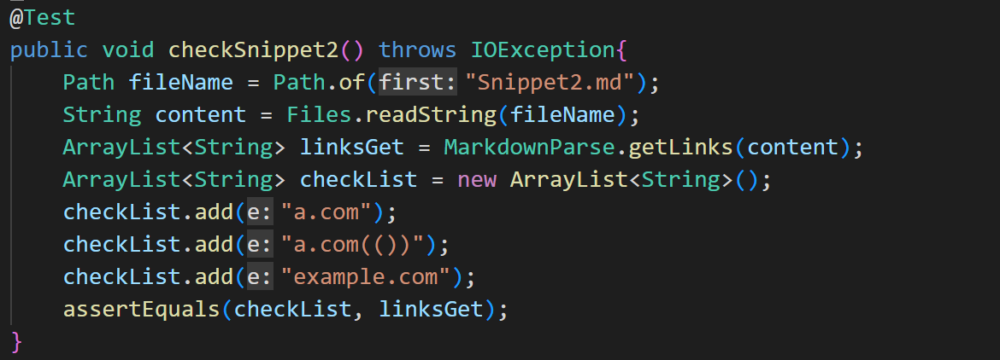

# Yucheng's Week 8 Lab Report 4
In this week's report, I will write about some tests of implementations of my repositary and the one I reviewed in the week 7. Let's start with the first snippet.
My link: `https://github.com/Ayuzzz127/cse15l-lab-reports`
The one I reviewed: `https://github.com/ednavho/ednafiles`

</img>

## The first one: 
Snippet one:
```
`[a link`](url.com)

[another link](`google.com)`

[`cod[e`](google.com)

[`code]`](ucsd.edu)
```


For Snippet one, it should produce 3 links:
```
`google.com, google.com,and ucsd.edu
```
But my implementation produce 4 links, which includes the url.com. That's because I didn't consider the case that backticks will let the bracket lose the function. I think there needs to be several lines (less than 10) to write a loop to change the contents between two bakcticks. We can change the string between them to other things so it will not considered as a bracket.

I find that the one I reviewed has the same question with mine. So we have the same question, and the change I mentioned below can also applied on this one.
## The second one: 


For Snippet 2, it should produce 3 links: `a.com, a.com(()), example.com`. But my implementation produce 2, and the second one is wrong. That's because I didn't consider the case that there's another pair of brackets in the brackets. This makes my code consider the first open bracket pair with the first close bracket. But the true output should consider the second open bracket. Though the first link is correct, it still has some questions, and for the second link, my code consider two pairs of parentheses in the parenthses as the close parenthesis. That makes the output in my code lose two close parenthese. And for the third link, similar with the first, My implementation wrongly connect the brackets so it considers the loop should break. We can change the logic of connect brackets, parentheses to fix these problems. We can check the index of the next openbracket and compare to the close bracket. If it is smaller, then connect them and consider them. If get a correct link, then we ignore the first open bracket and the second close bracket. If false, then just ignore them. That will fix problem one and three. We can do the similar thing to the parentheses. We check whether there's a pair of parentheses. If yes, we consider them as a normal string but not parentheses we need to ensure position. That will fix problem two. I think this will be more than 10 lines.

I find that the one I reviewed has the same question with mine. So we have the same question, and the change I mentioned below can also applied on this one.
## The third one: 


For Snippet 3, it should produce 1 links: `https://sites.google.com/eng.ucsd.edu/cse-15l-spring-2022/schedule`. But my implementation produce 3, and they include many spaces. We can fix the logic that if there's a space line in the pair of brackets/parentheses, we won't consider the content. And by the changing in the 2nd part, we won't consider all these things after the link which doesn't have a closing parenthesis, and therefore we won't return this extremely long link. So the change can be less than 10 lines

I find that the one I reviewed has the same question with mine. So we have the same question, and the change I mentioned below can also applied on this one.
# The End