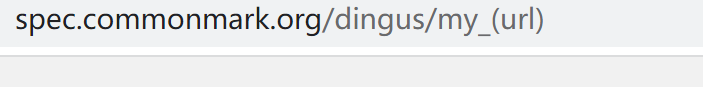

# Yucheng's Week 10 Lab Report 5

</img>

# The first one: 
[test194](https://github.com/nidhidhamnani/markdown-parser/blob/main/test-files/194.md?plain=1)

I used `vimdiff` and find a different result about this test file:

But both of the outputs are wrong.

In this image we can see the one of the actual output(my) is:`[]` and one(provided) is: `[url]`. But the expected output is:
`[my_(url)]`

About my own code, we should add a new rule in abstracting the link in the test file to fix the bug. According to the definition, the bug is happened by my file didn't recognize `:` as a sign for the link, also wrongly considered all things not tightly follows `[]` as a link. So here:

we should not just break if the `(` not tightly follows `]`. But consider other approved cases.

# The second one:
[test22](https://github.com/nidhidhamnani/markdown-parser/edit/main/test-files/22.md)

I used `vimdiff` and find a different result about this test file:

But both of the outputs are wrong.

In this image we can see the one of the actual output(my) is:`[/bar\* "ti\*tle"]` and one(provided) is: `[]`. But the expected output is:
`[bar*]`

About my own code, we should add a new rule in abstracting the link in the test file to fix the bug. According to the definition, the bug is happened by my file didn't recognize all content in the `()` that follows `[]` as a link. But in this case, not all the things in the parentheses are what we expectedly get. So we fix the code that describing the content between two parentheses:

Before add the all substring, we should first redirect the start point and end point of adding. So we should add a new int to show the correct start and end index and use them to indicate the subtring.

# Thank you!